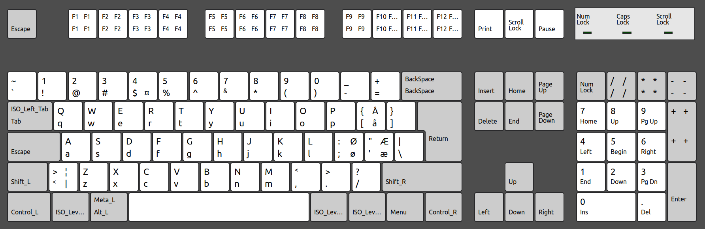

# AH keyboard layout

This is a keyboard layout I created for adding the Norwegian letters æ, ø, å to the layout without having to change layout.
This version also swaps the symbols and the numbers so that the "primary" function of the number keys are the symbols.
To get the actual numbers you have to hold shift. I made this change since I'm a developer and use symbols a lot more than numbers.

The Norwegian letters are accessed as "level 3". Personally I have set up right ALT and Super to act as level 3 modifiers.

I have also made CapsLock an additional Esc - this is more practical when using vim a lot.

```
// Normal press
`!@#$%^&*()-=

// Shift press
~1234567890_+
```



## Installing

Add it to you systems keyboard and restart your computer.

```
sudo cat AH-english-us >> /usr/share/X11/xkb/symbols/us
```

Then you have to update the `sudo vim /usr/share/X11/xkb/rules/evdev.xml` with the following, add it near the other English keyboards

```
<variant>
  <configItem>
    <name>AH-English-US</name>
    <description>AH English US layout</description>
    <vendor>AsbjornHaland</vendor>
  </configItem>
</variant>
```

It should now be selectable in the keyboard settings.
